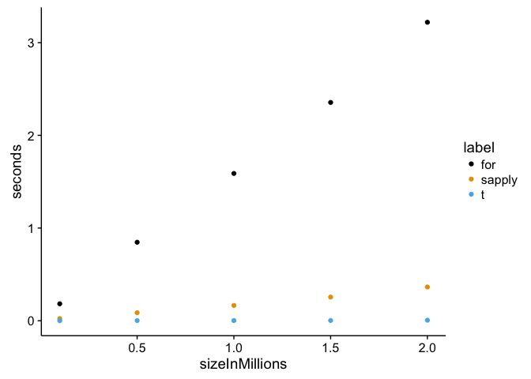

Instructions
============

This is the same package we put together as a class in early September,
with a few additions. The package currently resides on the server at
*/home/johnson/transpose*. Clone the repository to your local machine
and modify as instructed below.

For specifics on how this exam will be graded, see the rubric below.

The exam consists of three tasks worth 50 points each. Check your
progress often using the `R CMD CHECK transpose` command, and commit
chnages when appropriate (note: some things will be picked up by
`R CMD CHECK` even though they are excluded in *.Rbuildignore* - these
warnings are OK to ignore). You won't need to push any commits to the
source repository, since you don't have write permissions to my
directory. When you are finished, use `scp` to upload your modified git
repository to */home/johnson/midterm/transpose\_username*, where
*username* is your username. If you would prefer, I can verify that the
upload was successful, since you don't have permissions to view what is
in the *midterm* directory.

transpose\_vector() (50 pts)
----------------------------

Your first task is to create a new function called `transpose_vector()`.
This should take the same input and return the same output as
`transpose_loop()`, but use vectorization instead of a nested `for`
loop.

Remember:

-   Your R package should contain both functions and all appropriate
    documentation and NAMESPACE entries.
-   Make sure your function works before commiting.

Testing (50 pts)
----------------

The second task is to add some testing checks to the package to help
ensure that users get reasonable errors when they misuse your functions
and to make future changes to your package less buggy.

### User checks

Our code currently assumes that `x` is a matrix, but there is no
validation of this assumption. Add a function to the package called
`validate_x` that checks if the user submitted a matrix. This should be
called at the beginning of both `transpose_loop` and `transpose_vector`.

`validate_x`

-   Input: a matrix, `x`
-   Use `class(x)` to verify that `x` is a matrix.
-   If `class(x)` is not a matrix, use `stop()` to throw an error with a
    meaningful error message.
-   Output: none

Once you complete this function move to the package checks (don't forget
to commit this change to the repository).

### Package checks

When running `R CMD CHECK transpose`, the *testing/testthat.R* script
checks that everything is in order. There are currently two checks in
the *testing/testthat* directory:

-   Verify that `transpose_loop(x)` works when `x` is a matrix (done).
-   Verify that an error is thrown when no input is given to
    `transpose_loop()` (done).

Add a new testthat file with two more to checks:

-   Verify that `transpose_vector(x)` works when `x` is a matrix.
-   Verify that an error is thrown when `x` is a `data.frame`.

Documentation (50 pts)
----------------------

Finish filling in the next section on how to use this package. Make your
edits in `README.Rmd` and knit the file to create an updated Word
document.

Using this package
==================

This package was developed by the BIFX 552 class at Hood college to
practice R package building and to demonstrate the potential code
speedup when using comparing nested loops, vectorized code, and compiled
code.

Installation
------------

To install this package, you currently need to navigate to the directory
containing either the source code or the compiled R package and install
using `R CMD INSTALL`. You can download the package from
*/home/johnson/transpose* on the BIFX server at Hood college.

Comparison of transpose with base R
-----------------------------------

R is optimized for vector operations. For loops, especially nested for
loops, are known for being inefficient. To demonstrate this
inefficiency, we have created this package with two functions
replecating the functionality of the transpose function, `t()`:

-   `transpose_loop()` transposes a matrix using a nested for loop.
-   `transpose_vector()` uses vector operations to transpose the matrix.

The average speedup across the 5 sizes tested in this example is:

<table>
<thead>
<tr class="header">
<th align="right">Method</th>
<th align="center">Speedup over <code>for</code></th>
<th align="center">Speedup over <code>sapply</code></th>
</tr>
</thead>
<tbody>
<tr class="odd">
<td align="right"><code>sapply</code></td>
<td align="center"><code>9.1</code></td>
<td align="center"></td>
</tr>
<tr class="even">
<td align="right"><code>t</code></td>
<td align="center"><code>634.9</code></td>
<td align="center"><code>67.8</code></td>
</tr>
</tbody>
</table>

This figure shows the observed compute times for each method as the
matrix size increases by 500,000 elements.

Grading
=======

This exam will be graded on a curve as this is the first time this exam
has been administered. I anticipate that there will be about 2 A's and 3
B's, but if you all score similarly, I'm happy to give everyone A's. You
may use any resources you have available to you, but you are expected to
complete the exam on your own.

Rubric
------

<table>
<thead>
<tr class="header">
<th align="left">Tasks</th>
<th align="left">Skill level</th>
<th align="right">Points</th>
</tr>
</thead>
<tbody>
<tr class="odd">
<td align="left">Code</td>
<td align="left">Appropriate comments</td>
<td align="right">10%</td>
</tr>
<tr class="even">
<td align="left"></td>
<td align="left">Appropriate indentation</td>
<td align="right">10%</td>
</tr>
<tr class="odd">
<td align="left"></td>
<td align="left">Use of white space</td>
<td align="right">6%</td>
</tr>
<tr class="even">
<td align="left"></td>
<td align="left">Appropriate vectorization</td>
<td align="right">10%</td>
</tr>
<tr class="odd">
<td align="left"></td>
<td align="left">File header</td>
<td align="right">4%</td>
</tr>
<tr class="even">
<td align="left"></td>
<td align="left">Runtime errors in code</td>
<td align="right">-16%</td>
</tr>
<tr class="odd">
<td align="left"></td>
<td align="left">Task incomplete</td>
<td align="right">-20%</td>
</tr>
<tr class="even">
<td align="left"></td>
<td align="left"></td>
<td align="right"><strong>40%</strong></td>
</tr>
<tr class="odd">
<td align="left">Git repository</td>
<td align="left">Proper structure</td>
<td align="right">10%</td>
</tr>
<tr class="even">
<td align="left"></td>
<td align="left">Commit message formatting</td>
<td align="right">6%</td>
</tr>
<tr class="odd">
<td align="left"></td>
<td align="left">Commit only complete work</td>
<td align="right">6%</td>
</tr>
<tr class="even">
<td align="left"></td>
<td align="left">Clean repository history</td>
<td align="right">4%</td>
</tr>
<tr class="odd">
<td align="left"></td>
<td align="left">Commit only related changes</td>
<td align="right">4%</td>
</tr>
<tr class="even">
<td align="left"></td>
<td align="left">Small commits</td>
<td align="right">4%</td>
</tr>
<tr class="odd">
<td align="left"></td>
<td align="left">Appropriate use of <em>.gitignore</em></td>
<td align="right">6%</td>
</tr>
<tr class="even">
<td align="left"></td>
<td align="left"></td>
<td align="right"><strong>40%</strong></td>
</tr>
<tr class="odd">
<td align="left">R Package</td>
<td align="left">Installs without errors or warnings</td>
<td align="right">10%</td>
</tr>
<tr class="even">
<td align="left"></td>
<td align="left">Documentation complete</td>
<td align="right">6%</td>
</tr>
<tr class="odd">
<td align="left"></td>
<td align="left">Appropriate NAMESPACE entries</td>
<td align="right">4%</td>
</tr>
<tr class="even">
<td align="left"></td>
<td align="left"></td>
<td align="right"><strong>20%</strong></td>
</tr>
</tbody>
</table>
